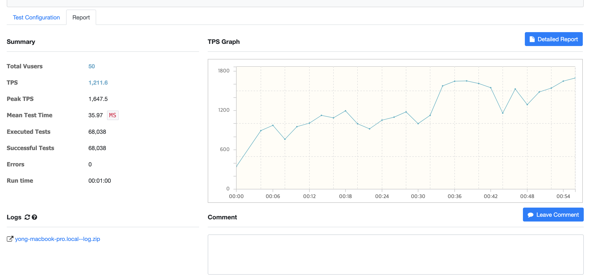

# 쿠폰 발급 시스템

## 개요

이 프로젝트는 Kotlin 기반의 Spring Boot WebFlux 어플리케이션으로, Redis를 활용해 쿠폰 발급 시스템을 구현한 예제입니다.  
주요 기능은 쿠폰 재고 관리, 사용자별 중복 발급 방지, 그리고 Redis Stream을 통한 비동기 발급 요청 처리입니다.

---

## 주요 기술 스택

- Kotlin
- Spring Boot WebFlux (Reactive Programming)
- Redis (Key-Value 저장소, Stream, Lua 스크립트)
- Reactor

---

## 시스템 아키텍처
```html
Client (User/Admin)
├─ REST API 요청 (쿠폰 등록 / 발급 요청)
│
Spring Boot WebFlux API 서버
├─ 쿠폰 재고 조회 및 요청 수 관리 (Redis Key-Value)
├─ 쿠폰 발급 요청 Kafka Message 발행
│
Redis Server
├─ 쿠폰 재고, 발급 요청 카운터 저장
├─ 쿠폰 발급 요청 Stream (coupon-requests)
├─ 사용자 중복 발급 체크 키 저장
│
Kafka Stream
├─ Stream 메시지 비동기 처리
├─ Lua 스크립트로 재고 감소 및 중복 체크 원자적 처리
├─ 발급 성공/실패 로그 
```
---

## 설치 및 실행 방법

1. Redis 설치 및 실행 (기본 설정 사용 권장)
   ```bash
   docker-compose -f ./docker/docker-compose.yml up
   ```
## 프로젝트 클론 및 빌드
git clone <repo-url>
cd coupon-issuance
./gradlew build


## 애플리케이션 실행

bash
복사
편집
./gradlew bootRun
API 호출 (기본 포트 8080)

## API 명세
1. 쿠폰 등록
````http request
POST {{host}}/api/v1/coupon/issuedCoupon
Content-Type: application/json
{
  "couponGroupName": "이벤트 쿠폰",
  "issuedCount": 5000,
  "issuedAvailableTime": "2025-06-01T13:00:00+09:00",
  "expiredAt": "2025-06-10T13:00:00+09:00",
  "couponGroup": [
    {
      "couponName": "20000원 쿠폰",
      "amount": 20000
    },
    {
      "couponName": "10000원 쿠폰",
      "amount": 10000
    },
    {
      "couponName": "5000원 쿠폰",
      "amount": 5000
    },
    {
      "couponName": "4000원 쿠폰",
      "amount": 4000
    },
    {
      "couponName": "3000원 쿠폰",
      "amount": 3000
    },
    {
      "couponName": "2000원 쿠폰",
      "amount": 2000
    },
    {
      "couponName": "1000원 쿠폰",
      "amount": 1000
    }
  ]
}

Response:
{
  "couponGroupId": "fc5e8f41-30fd-42b6-a234-1ed0f8885b74",
  "couponGroupName": "이벤트 쿠폰"
}

200 OK: 쿠폰 등록 완료 메시지
````

2. 쿠폰 발급 요청
````http request
POST {{host}}/api/v1/coupon/request/e74015dc-9f69-4fa3-a714-f893c9675963
Content-Type: application/json

{
  "userId": "logan",
  "issuedType": "RANDOM"
}


Response:

200 OK: 발급 요청 성공

400 Bad Request: 재고 부족으로 발급 실패
````
## 내부 동작 상세
1) 쿠폰 등록
   1) 관리자가 쿠폰 아이디와 수량을 API로 등록하면, Redis에 쿠폰 재고 키(coupon:{couponGroupId}:stock)를 저장합니다.

2) 쿠폰 발급 요청
   1) 사용자가 발급 요청 API를 호출하면 다음이 수행됩니다:

Redis에 coupon:{couponGroupId}:stock에 쿠폰 그룹의 전체 제고를 적재

요청 수가 현재 재고(coupon:{couponId}:stock)보다 많으면 즉시 실패 응답 반환.

그렇지 않으면, Kafka Stream(coupon-requests)에 요청 정보를 저장해 비동기 처리 대기.

3) Redis Stream 소비 및 쿠폰 발급 처리
   1) 별도의 Redis Stream Consumer가 주기적으로 요청 메시지를 읽습니다.

각 요청에 대해 Lua 스크립트를 실행해 다음 작업을 원자적으로 수행합니다:

재고가 남아있는지 확인

사용자가 이미 쿠폰을 받았는지 확인 (중복 체크)

재고 차감 및 사용자 중복 발급 키 생성

Lua 스크립트 결과에 따라 발급 성공/실패를 로그에 기록합니다.

## Redis Lua 스크립트
````javascript
if redis.call('exists', KEYS[1]) == 1 then
return false
end
local stock = tonumber(redis.call('GET', KEYS[2]))
if not stock or stock <= 0 then return false end
local couponStock = tonumber(redis.call('GET', KEYS[3]))
if not couponStock or couponStock <= 0 then return false end
redis.call('set', KEYS[1], '1')
redis.call('decr', KEYS[2])
redis.call('decr', KEYS[3])
return true
KEYS[1]: 사용자 쿠폰 발급 유효성 체크 키 (coupon:${couponGroupId}:user:${userId})

KEYS[2]: 쿠폰 그룹 전체 재고 키 (coupon:${couponGroupId}:stock)

KEYS[3]: 쿠폰 그룹의 상세 쿠폰 재코 키(coupon:${couponGroupId}:${couponId}:stock)

반환값:

true: 성공

false: 실패

````
## 주요 고려사항 및 확장 포인트
Redis의 Lua 스크립트로 원자적 처리 보장 → 동시성 문제 예방

Redis Stream을 활용한 비동기 발급 처리로 API 부하 분산

요청 수 초과시 빠른 실패 처리로 불필요한 부하 감소

로그 저장소 확장 가능 (파일, DB, 모니터링 시스템 연동)

사용자 발급 정보 만료 정책 추가 가능 (ex: 쿠폰 유효 기간)

관리자 대시보드 개발 및 쿠폰 통계 추가 가능

### 참고자료
Spring Data Redis WebFlux 공식문서

Redis Lua Scripting

Reactive Programming with Reactor

문의
시스템 관련 질문이나 제안은 이슈 혹은 메일로 문의 부탁드립니다.

---

# 실행 결과
### vUser50
- 

### vUser100

- 

### vUser200
- 

### vUser300
- 